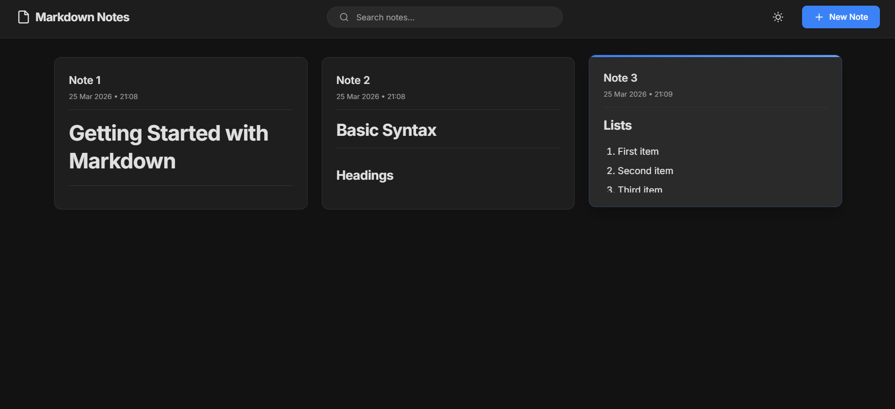
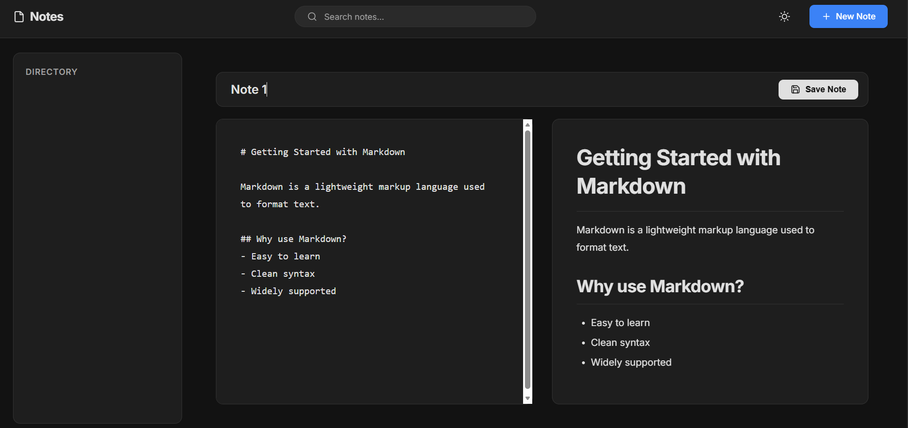
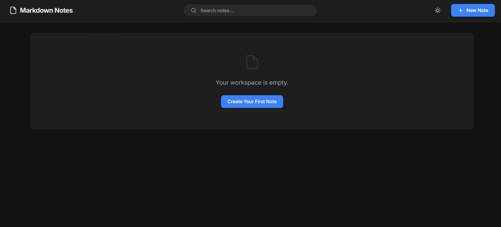
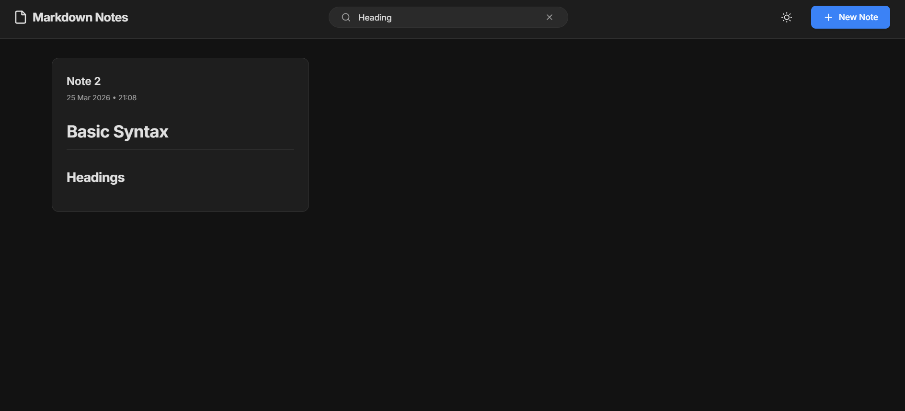

# Markdown Notes Manager

## Overview

Markdown Notes Manager is a web application built with **Java + Spring Boot** that lets users create, edit, view, delete, and search personal notes written in Markdown format. Notes can be organized into **folders**, visually distinguished with **accent colors**, and the entire interface supports **light and dark themes**.

For deeper architecture and change history, see [`documentation.md`](./documentation.md).

---

## Tech Stack

| Layer | Technology |
|---|---|
| Language | Java 17+ |
| Framework | Spring Boot 3.x |
| Web / Routing | Spring Web MVC |
| Templating | Thymeleaf |
| ORM | Spring Data JPA (Hibernate) |
| Database | H2 (file-based persistent, in-memory for tests) |
| Frontend | Vanilla JS, Marked.js |

---

## Features

- Clean MVC structure (`controller/`, `service/`, `repository/`, `model/`)
- Markdown editor with live split-view preview
- Keyword search across note title and content
- Light / dark theme via CSS variables + `localStorage`
- **Folder organization** — create named folders, assign notes, filter by folder
- **Accent color coding** — each note gets a color from a curated palette; shown as a left border on cards
- **Persistent storage** — H2 file-based DB under `data/`; survives app restarts

---

## Project Structure

```
markdownnotes/
├── src/main/java/com/example/markdownnotes/
│   ├── MarkdownnotesApplication.java
│   ├── bootstrap/
│   │   └── AccentColorBackfill.java       ← one-time startup color assignment
│   ├── controller/
│   │   └── NoteController.java            ← HTTP routes (notes + folders)
│   ├── model/
│   │   ├── Note.java                      ← JPA entity (+ accentColor, folder FK)
│   │   └── Folder.java                    ← JPA entity
│   ├── repository/
│   │   ├── NoteRepository.java
│   │   └── FolderRepository.java
│   └── service/
│       ├── NoteService.java
│       └── FolderService.java
├── src/main/resources/
│   ├── application.properties             ← file-based H2, port 8082
│   ├── static/css/style.css
│   └── templates/
│       ├── index.html                     ← sidebar + notes grid
│       └── editor.html                    ← split-view editor
├── src/test/resources/
│   └── application.properties            ← in-memory H2 for tests
├── data/                                  ← H2 DB files (gitignored)
└── pom.xml
```

---

## Run Locally

### Prerequisites
- Java 17+
- Maven or the included Maven Wrapper

### Start the app

**Windows:**
```powershell
.\mvnw.cmd spring-boot:run
```

**macOS / Linux:**
```bash
./mvnw spring-boot:run
```

### Open in browser

| URL | Purpose |
|---|---|
| `http://localhost:8082/` | Main app |
| `http://localhost:8082/new` | New note |
| `http://localhost:8082/edit/{id}` | Edit note |
| `http://localhost:8082/h2-console` | H2 database console |

**H2 Console credentials:**
- JDBC URL: `jdbc:h2:file:./data/markdownnotes`
- Username: `sa`
- Password: *(blank)*

### Folder routes

| Method | URL | Action |
|---|---|---|
| `POST` | `/folders` | Create folder |
| `GET` | `/folders/delete/{id}` | Delete folder (notes → Uncategorized) |
| `GET` | `/?folderId={id}` | Filter notes by folder |
| `GET` | `/?folderId=0` | Show Uncategorized notes |

---

## Test

```powershell
.\mvnw.cmd test
```
```bash
./mvnw test
```

Tests use an in-memory H2 database (`src/test/resources/application.properties`) and do not touch the file-based database.

---

## Screenshots

### Notes Dashboard with Folder Sidebar


### Markdown Editor with Live Preview


### Empty Workspace


### Search Results
